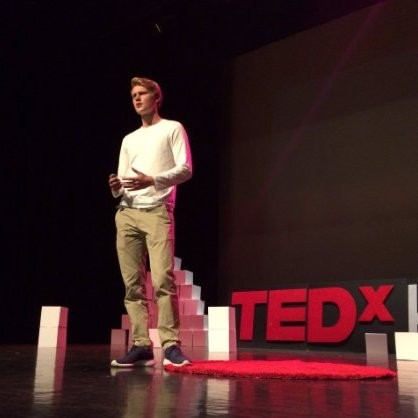

## Blockchain Track

# [Link to Tech Lecture Plan](https://docs.google.com/spreadsheets/d/1Mf8c0Guyzmtj-YC6nZJ-7XrByDN1QcqSSRDQ9jnAP60/edit?usp=sharing)

**Time**: Jan 21 - Jan 31: 9AM-noon / 2-5PM

**Locations**:
* [240 Bechtel](https://wheelerrenewal.berkeley.edu/surge-spaces/bechtel-hall-room-240)
* [242 Sutardja Dai Hall](https://www.berkeley.edu/map?sutardja)
* [786 Davis](https://www.berkeley.edu/map?davis)
* [217 McLaughlin](https://www.berkeley.edu/map?mclaughlin)
* [290 Hearst Mining](https://www.berkeley.edu/map?hearstmining)
* [Chou Hall](https://www.berkeley.edu/map?chou)
* [Sutardja Center for Entrepreneurship and Technology](https://www.google.com/maps/place/Sutardja+Center+for+Entrepreneurship+and+Technology/@37.871124,-122.2518838,15z/data=!4m2!3m1!1s0x0:0xdafcf8acc9048bcb?sa=X&ved=2ahUKEwjC3__nh5jnAhV5GDQIHeXtCTQQ_BIwCnoECA0QCA)

## Course description
The blockchain track will cover state-of-the art approaches for practical blockchain understanding and application development. We'll cover foundations, deep dives into Bitcoin / Ethereum / Lightning / Plasma, blockchain applications, smart contract and dApp development, legal aspects, interoperability solutions, architectures, and guest lectures will be given be blockchain entrepreneurs as well as industry fellows (from Coinbase etc).

## Readings

To get a good, comprehensive understanding of Blockchain technology we recommend that you read (or skim the following books):

* [The Truth Machine](https://www.amazon.com/Truth-Machine-Blockchain-Future-Everything/dp/B07B4MLBW8/ref=sr_1_1?ie=UTF8&qid=1533811586&sr=8-1&keywords=truth+machine)
* [The Basics of Bitcoins and Blockchains](https://www.amazon.com/Basics-Bitcoins-Blockchains-Introduction-Cryptocurrencies/dp/1633538001)
* [The Internet of Money](https://www.amazon.com/The-Internet-of-Money/dp/B071KX8WP8/ref=sr_1_5?ie=UTF8&qid=1533811605&sr=1-5&keywords=mastering+bitcoin)
* [Mastering Ethereum (tehnical)](https://www.amazon.com/Mastering-Ethereum-Building-Smart-Contracts/dp/1491971940)
* [Mastering Bitcoin (technical)](https://www.amazon.com/Mastering-Bitcoin-Programming-Open-Blockchain/dp/1491954388/ref=sr_1_4?s=books&ie=UTF8&qid=1533811605&sr=1-4&keywords=mastering+bitcoin)
* [Bitcoin and Cryptocurrency Technologies (technical)](http://bitcoinbook.cs.princeton.edu/) - Free introductory book available on website

## Links to lecture slides

1. [Lecture 1 TBA]
2. [Lecture 2 TBA]

## Grading rubric

- Lowtech demo (pitch your project) 15%
- System architecture + UI / UX flow 10%
- Technical whitepaper 15%
- MVP / PoC (Demo or Die) 15%
- Ethereum Final (test + implementation) 20%
- Homeworks / reports 20%
- Participation / Attendance 5%

## Contact

We'll have a bCourses group for the blockchain students. Feel free to ask questions and stay in contact with the teaching team there.

## FAQ

**Cloud Credits**
For students who need computing resources for the class project, it is recommended that you to look into AWS educate program for students or sign up for a Google Cloud account. You’ll get a couple of hundreds of dollar’s worth of sign up credit. Here are the links: [AWS](https://aws.amazon.com/education/awseducate/apply/) and [Google Cloud Platform](https://cloud.google.com/free/).

## Instructor(s)

<table style="table-layout: fixed; font-size: 88%; width:600px;">
  <thead>
    <tr>
      <th style="width: 10%;"></th>
      <th style="width: 10%;"></th>
      <th style="width: 10%;"></th>
      <th style="width: 10%;"></th>
    </tr>
  </thead>
  <tbody>
    <tr>
          <td><a href="http://maxfa.ng/">Max Fang</a>  (Instructor)</td>
          <td><a href="https://www.linkedin.com/in/hamdiallam/">Hamdi Allam</a>  (Instructor)</td>
          <td><a href="https://www.linkedin.com/in/wesleygraham">Wesley Graham</a>  (Instructor)</td>
          <td><a href="https://alex.fo/">Alexander Fred-Ojala</a>  (Instructor)</td>
    </tr>
    <tr>
      <td><a href="https://blockchain.berkeley.edu">Blockchain at Berkeley</a></td>
      <td><a href="https://github.com/fourthstate">FourState Labs</a></td>
      <td><a href="https://github.com/fourthstate">FourState Labs</a></td>
      <td><a href="http://scet.berkeley.edu/data-lab">SCET, Data Lab</a></td>
    </tr>
  </tbody>
</table>
